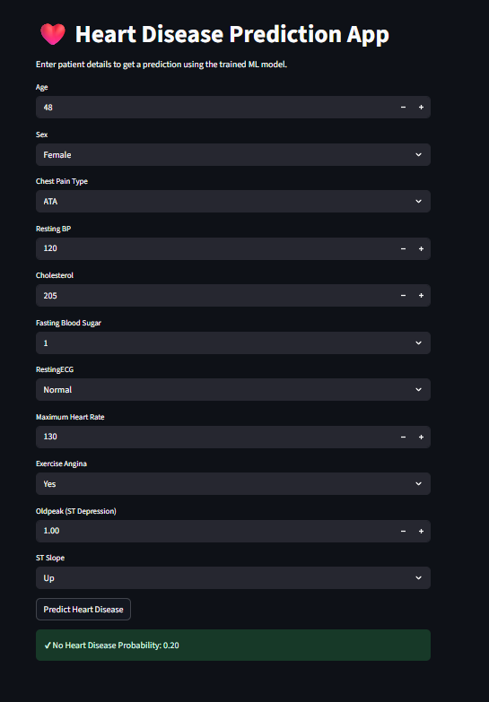

# ❤️ Heart Disease Prediction using Machine Learning (Scikit-learn Pipeline)

## 📌 Project Overview
Heart disease is one of the leading causes of death worldwide. Early and accurate prediction can help healthcare professionals take preventive actions and reduce mortality.

This project implements an **end-to-end machine learning classification system** for heart disease prediction using a **Scikit-learn Pipeline**, ensuring clean preprocessing, reproducibility, and seamless deployment.

The pipeline integrates **data preprocessing, feature encoding, model training, evaluation, and model persistence** in a single workflow.

---

## 🎯 Problem Statement
To build a robust machine learning model that predicts whether a patient has heart disease based on clinical attributes, while prioritizing **Recall** and **ROC-AUC**, which are crucial metrics in medical diagnosis problems where false negatives are costly.

---

## 📁 Project Structure
HEARTDISEASEPREDICTION/
│
├── Dataset/
│ └── Heart_dataset.csv
│
├── Notebook/
│ └── Heart.ipynb
│
├── app.py
├── heart_model.pkl
└── README.md


---

## 📊 Dataset Description
- File: `Heart_dataset.csv`
- Each row represents a patient’s medical record
- Target variable:
  - `0` → No Heart Disease
  - `1` → Heart Disease

### Key Features
- Age  
- Sex  
- Chest pain type  
- Resting blood pressure  
- Serum cholesterol  
- Fasting blood sugar  
- Resting ECG  
- Maximum heart rate achieved  
- Exercise-induced angina  
- ST depression  
- Slope of ST segment  

---

## 🔍 Methodology

### 1️⃣ Importing Necessary Libraries
  - Inspecting the Datset
---


### 2️⃣ Pipeline-Based Preprocessing
All preprocessing steps are handled using a **Scikit-learn `Pipeline` and `ColumnTransformer`**, ensuring consistency between training and inference.

#### Preprocessing Steps:
- **Numerical Features**
  - Missing value imputation (SimpleImputer)
  - Feature scaling (StandardScaler)

- **Categorical Features**
  - One-hot encoding for nominal features
  - Ordinal encoding for ordered features
  - Missing value handling using SimpleImputer

This approach prevents **data leakage** and simplifies deployment.

---

### 3️⃣ Model Training
The final pipeline uses a **RandomForestClassifier** integrated directly into the preprocessing pipeline.

#### Model Configuration:
- `n_estimators = 100`
- `max_features = 'sqrt'`
- `min_samples_split = 5`
- `min_samples_leaf = 2`
- `random_state = 42`

The model was trained using a train-test split to evaluate generalization performance.

---

## 📈 Model Evaluation

### ✅ Training Performance
- **Accuracy:** 97.19%
- **Precision:** 96.93%
- **Recall:** 98.16%
- **F1 Score:** 97.54%
- **ROC-AUC:** 0.9977

---

### ✅ Testing Performance
- **Accuracy:** 91.41%
- **Precision:** 91.85%
- **Recall:** 93.12%
- **F1 Score:** 92.48%
- **ROC-AUC:** 0.9593

The strong test ROC-AUC and recall indicate good generalization and reliable predictive performance for a medical classification problem.

---

## 🧠 Model Persistence
- The entire trained pipeline (preprocessing + model) is saved as:
heart_model.pkl
- The saved model can be directly loaded for inference without reapplying preprocessing manually.

---

## 🖥️ Streamlit Web Application
A **Streamlit-based web application** was developed to demonstrate real-time predictions.

### App Features:
- User-friendly input interface
- Uses the saved pipeline model (`heart_model.pkl`)
- Automatically applies preprocessing and prediction
- Displays prediction results instantly

---
## 🖥️ Streamlit Application Screenshots

### 🔹 Application Interface

> The application allows users to input patient medical details and instantly predicts heart disease risk using the trained ML pipeline.


## 🚀 How to Run the Project Locally

### 1️⃣ Clone the Repository
```bash
git clone https://github.com/your-username/heart-disease-prediction-ml.git
cd heart-disease-prediction-ml

Install Dependencies
pip install -r requirements.txt

Run the Streamlit App
streamlit run app.py

🧰 Tools & Technologies Used

Python

Pandas, NumPy

Matplotlib, Seaborn

Scikit-learn (Pipeline, ColumnTransformer)

RandomForestClassifier

Joblib

Streamlit

🔮 Future Enhancements

Model explainability using SHAP

Hyperparameter tuning with GridSearchCV

Cross-validation

Cloud deployment (AWS / Render / Hugging Face)

📌 Key Takeaways

Importance of pipeline-based ML workflows

Avoiding data leakage using proper preprocessing

Metric selection for medical classification problems

Deploying ML models using Streamlit

🙌 Author

Himanshu Shekhar
B.Tech (CSE) | Machine Learning & Data Science Enthusiast

⭐ Acknowledgement

If you find this project useful, consider giving it a ⭐ on GitHub.