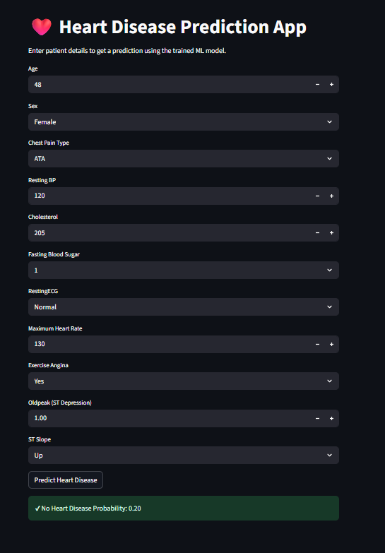

# ❤️ Heart Disease Prediction using Machine Learning

[](https://heart-disease-prediction-usingml.streamlit.app/)
[](https://github.com/himanshu-shekhar2327/heart-disease-prediction-ml)
[](https://www.python.org/)
[](https://scikit-learn.org/)

---

## 📌 Project Overview

Heart disease is one of the leading causes of death worldwide. Early and accurate prediction can help healthcare professionals take preventive actions and significantly reduce mortality.

This project implements an **end-to-end machine learning classification system** for heart disease prediction using a **Scikit-learn Pipeline**, ensuring clean preprocessing, reproducibility, and seamless deployment via Streamlit.

🔗 **Live App:** [https://heart-disease-prediction-usingml.streamlit.app/](https://heart-disease-prediction-usingml.streamlit.app/)

---

## 🖥️ App Screenshot



> Enter patient medical details and instantly get a heart disease risk prediction powered by a trained Random Forest pipeline.

---

## 🎯 Problem Statement

Build a robust ML model that predicts whether a patient has heart disease based on clinical attributes, while prioritizing **Recall** and **ROC-AUC** — the most critical metrics in medical diagnosis where false negatives carry serious consequences.

---

## 📁 Project Structure

```
heart-disease-prediction-ml/
│
├── Dataset/
│   └── Heart_dataset.csv
│
├── Notebook/
│   └── Heart.ipynb
│
├── app.py
├── heart_model.pkl
├── requirements.txt
├── screenshot.png
└── README.md
```

---

## 📊 Dataset Description

- **File:** `Heart_dataset.csv`
- **Records:** 918 patients
- **Target:** `HeartDisease` → `0` = No Disease, `1` = Disease Present

### Features

| Feature | Type | Description |
|---|---|---|
| Age | Numerical | Age of the patient |
| Sex | Categorical | Male / Female |
| ChestPainType | Categorical (Ordinal) | ATA, NAP, TA, ASY |
| RestingBP | Numerical | Resting blood pressure (mm Hg) |
| Cholesterol | Numerical | Serum cholesterol (mm/dl) |
| FastingBS | Numerical | Fasting blood sugar > 120 mg/dl (1 = True) |
| RestingECG | Categorical | Normal, ST, LVH |
| MaxHR | Numerical | Maximum heart rate achieved |
| ExerciseAngina | Categorical | Exercise-induced angina (Yes/No) |
| Oldpeak | Numerical | ST depression induced by exercise |
| ST_Slope | Categorical (Ordinal) | Up, Flat, Down |

---

## 🔍 Methodology

### 1️⃣ Pipeline-Based Preprocessing

All preprocessing is handled inside a **Scikit-learn `Pipeline` + `ColumnTransformer`**, which prevents data leakage and ensures identical transformations at training and inference time.

| Feature Group | Features | Transformation |
|---|---|---|
| Numerical | Age, RestingBP, Cholesterol, FastingBS, MaxHR, Oldpeak | Median Imputation → StandardScaler |
| Nominal Categorical | Sex, RestingECG, ExerciseAngina | Mode Imputation → OneHotEncoder |
| Ordinal — ChestPainType | ATA < NAP < TA < ASY | Mode Imputation → OrdinalEncoder |
| Ordinal — ST_Slope | Down < Flat < Up | Mode Imputation → OrdinalEncoder |

### 2️⃣ Model Training

A **RandomForestClassifier** is integrated directly into the pipeline as the final estimator.

```python
RandomForestClassifier(
    n_estimators=100,
    max_features='sqrt',
    min_samples_split=5,
    min_samples_leaf=2,
    random_state=42
)
```

The model was trained using an 80/20 stratified train-test split to preserve class distribution.

---

## 📈 Model Performance

### Training Results

| Metric | Score |
|---|---|
| Accuracy | **97.19%** |
| Precision | **96.93%** |
| Recall | **98.16%** |
| F1 Score | **97.54%** |
| ROC-AUC | **0.9977** |

### Testing Results

| Metric | Score |
|---|---|
| Accuracy | **91.41%** |
| Precision | **91.85%** |
| Recall | **93.12%** |
| F1 Score | **92.48%** |
| ROC-AUC | **0.9593** |

> Strong test recall (93.12%) means the model correctly identifies the vast majority of actual heart disease patients — minimizing dangerous false negatives.

---

## 🧠 Model Persistence

The entire trained pipeline (preprocessing + model) is saved as a single file:

```python
import joblib
joblib.dump(final_pipe, "heart_model.pkl")
```

At inference time, the saved pipeline automatically applies all preprocessing steps before prediction — no manual feature engineering needed.

---

## ☁️ Deployment on Streamlit Cloud

The app is deployed live on **Streamlit Community Cloud** at:
🔗 [https://heart-disease-prediction-usingml.streamlit.app/](https://heart-disease-prediction-usingml.streamlit.app/)

### Deployment Stack

| Component | Detail |
|---|---|
| Platform | Streamlit Community Cloud |
| Python Version | 3.12 (set explicitly in app settings) |
| Model File | `heart_model.pkl` (committed to GitHub repo) |
| Dependencies | Pinned in `requirements.txt` |

### Requirements

```
scikit-learn==1.4.2
numpy==1.26.4
pandas==2.2.2
joblib==1.4.2
xgboost
matplotlib
seaborn
streamlit
```

### ⚠️ Critical Deployment Lesson — Version Compatibility

During deployment, the app threw an `AttributeError` when loading `heart_model.pkl`:

```
File "app.py", line 9, in <module>
    model = joblib.load("heart_model.pkl")
AttributeError: Can't get attribute ... on <module 'sklearn...'>
```

**Root Cause:** The `.pkl` file was serialized with **scikit-learn 1.8.0 on Python 3.13** locally, but Streamlit Cloud installed a different sklearn version — making the pickle unreadable.

**Fix Applied:**
1. Created a clean virtual environment using **Python 3.12** (matching Streamlit Cloud)
2. Installed stable, compatible library versions (`scikit-learn==1.4.2`, `numpy==1.26.4`, `pandas==2.2.2`)
3. Retrained and re-saved the model inside this environment
4. Pinned exact versions in `requirements.txt`
5. Set Python version to **3.12** in Streamlit Cloud app settings

> **Key Rule:** The Python version and scikit-learn version used to **save** the `.pkl` must exactly match the **deployment environment**. Always pin your library versions and use a clean virtual environment for training before deploying.

### Steps to Deploy Your Own Fork

1. Fork this repository on GitHub
2. Go to [share.streamlit.io](https://share.streamlit.io) and sign in
3. Click **New app** → select your forked repo → set `app.py` as the main file
4. Under **Advanced settings** → set Python version to **3.12**
5. Click **Deploy** — Streamlit will install `requirements.txt` automatically

---

## 🚀 Run Locally

### 1. Clone the Repository

```bash
git clone https://github.com/himanshu-shekhar2327/heart-disease-prediction-ml.git
cd heart-disease-prediction-ml
```

### 2. Create a Virtual Environment (Recommended)

```bash
python -m venv venv
venv\Scripts\activate       # Windows
# source venv/bin/activate  # macOS/Linux
```

### 3. Install Dependencies

```bash
pip install -r requirements.txt
```

### 4. Run the App

```bash
streamlit run app.py
```

---

## 🧰 Tech Stack

| Category | Tools |
|---|---|
| Language | Python 3.12 |
| Data Processing | Pandas, NumPy |
| ML Framework | Scikit-learn (Pipeline, ColumnTransformer, RandomForest) |
| Visualization | Matplotlib, Seaborn |
| Model Persistence | Joblib |
| Deployment | Streamlit Cloud |

---

## 🔮 Future Enhancements

- [ ] Model explainability with **SHAP values**
- [ ] Hyperparameter tuning with **GridSearchCV / Optuna**
- [ ] Cross-validation for more robust evaluation
- [ ] Comparison with XGBoost, LightGBM, SVM
- [ ] Extended deployment on **Hugging Face Spaces / Render**

---

## 📌 Key Learnings

- Building **pipeline-based ML workflows** for clean, reproducible code
- Preventing **data leakage** using `ColumnTransformer` inside a `Pipeline`
- Choosing the **right metrics** (Recall, ROC-AUC) for medical classification
- Deploying end-to-end ML models with **Streamlit Cloud**
- Managing **Python and library version compatibility** for stable deployments

---

## 🙌 Author

**Himanshu Shekhar**  
B.Tech (CSE) — Silicon University, Bhubaneswar  
Machine Learning & Data Science Enthusiast

[](https://github.com/himanshu-shekhar2327)

---

## ⭐ Support

If you find this project useful, consider giving it a ⭐ on [GitHub](https://github.com/himanshu-shekhar2327/heart-disease-prediction-ml) — it means a lot!
